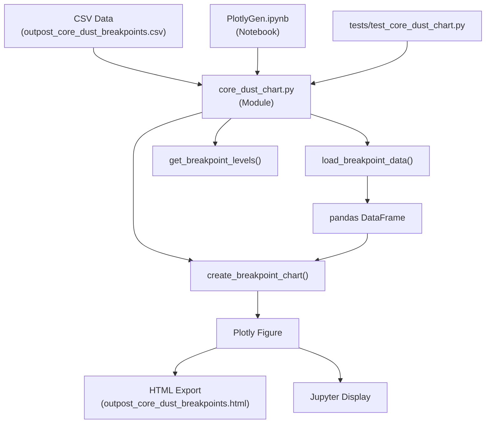

# Nikke Core Dust Breakpoints Analysis

**Analyze optimal outpost levels for maximum core dust production in Goddess of Victory: NIKKE**

[](https://github.com/whykusanagi/nikke_coredust)
[](LICENSE)

<div align="center" style="margin: 2rem 0;">
<p align="center"></p>
</div>

## Overview

This Python project analyzes core dust production across different outpost levels in NIKKE to identify optimal breakpoints—specific levels where core dust production increases significantly. **The breakpoint is the level where you CROSS the threshold and gain the benefit**—you profit when you reach that level, not before. By focusing on reaching these breakpoint levels, players can optimize their resource acquisition and character development.

**How Outpost Leveling Works:** You gain one outpost level per stage cleared in campaign (both normal and hard mode). This means every stage you push directly contributes to your outpost level, making breakpoint planning crucial for efficient progression.

The project provides both a modular Python library and a Jupyter notebook interface for generating interactive Plotly visualizations.

## Features

- **Data-Driven Analysis**: Combines data from Reddit, Discord, and personal gameplay
- **Visual Breakpoint Identification**: Interactive Plotly bar chart clearly shows production jumps
- **Modular Architecture**: Core logic extracted to reusable Python module
- **Unit Tested**: Comprehensive test coverage for reliability
- **Easy to Use**: Jupyter notebook format with step-by-step code
- **Exportable Results**: Generate HTML charts for sharing or documentation
- **Campaign Progression Planning**: Calculate how many stages to push for next breakpoint
- **Competitive Advantage Analysis**: Understand resource accumulation over time

## Architecture



### Module Structure

- **`core_dust_chart.py`**: Core module containing:
  - `load_breakpoint_data()`: CSV loading with validation
  - `create_breakpoint_chart()`: Plotly chart generation
  - `get_breakpoint_levels()`: Breakpoint extraction utility
  - `generate_chart()`: Complete workflow function

- **`PlotlyGen.ipynb`**: Jupyter notebook using the module for interactive analysis

- **`tests/`**: Unit tests ensuring data validation and chart generation correctness

## Why Breakpoints Matter

### Campaign Progression

When you're pushing hard campaign or normal campaign, each stage cleared gives you one outpost level. Reaching a breakpoint means more core dust per hour, which directly helps you:

- **Level faster**: More core dust per hour accelerates your character leveling
- **Beat difficult stages**: Some stages aren't beatable until you level up your characters—reaching breakpoints gives you the resources to level and overcome these walls
- **Plan your campaign pushes**: Know exactly which stages to push for to reach the next breakpoint
- **Optimize progression timing**: Time your campaign pushes to coincide with breakpoint levels for maximum efficiency

### Competitive Advantage

If you're competing with other players (rankings, guilds, etc.), having more resources per hour gives you a significant advantage:

- **Out-level competitors**: Given enough time, more core dust per hour means you'll out-level players who haven't optimized their breakpoints
- **Sustained resource advantage**: The hourly production difference compounds over days and weeks
- **Faster character development**: More resources = faster upgrades = stronger teams = better competitive performance

## Quick Start

### Prerequisites

- Python 3.7+
- Jupyter Notebook or JupyterLab (for notebook interface)
- pip or conda

### Installation

```bash
# Clone the repository
git clone https://github.com/whykusanagi/nikke_coredust.git
cd nikke_coredust

# Install dependencies
pip install -r requirements.txt

# Or using conda
conda install --file requirements.txt
```

### Usage

#### Option 1: Jupyter Notebook (Recommended)

1. **Start Jupyter**:
   ```bash
   jupyter notebook PlotlyGen.ipynb
   ```

2. **Run all cells** to generate the core dust breakpoint chart

3. **Review the chart** to identify optimal outpost levels

#### Option 2: Python Script

```python
from core_dust_chart import generate_chart, get_breakpoint_levels, load_breakpoint_data

# Generate chart (automatically detects breakpoints from new CSV)
fig = generate_chart(
    csv_path="coredust_levels_outpost.csv",
    output_html="outpost_core_dust_breakpoints.html"
)

# Extract breakpoint levels
data = load_breakpoint_data("coredust_levels_outpost.csv")
breakpoints = get_breakpoint_levels(data)
print(f"Breakpoint levels: {breakpoints}")
```

#### Option 3: Web App

1. **Copy `web_app.html`** to your web server (or integrate into main site)
2. **Ensure `coredust_levels_outpost.csv`** is in the same directory
3. **Open in browser** - the app will:
   - Load data from CSV
   - Automatically detect breakpoints
   - Display interactive chart with level range filter
   - Show breakpoint list

**Note**: The web app uses corrupted-theme styling. Paths are relative to the main site root. If integrating into the main site, place `web_app.html` in the appropriate directory and update paths as needed.

## How It Works

The module uses Plotly to create a bar chart visualizing the relationship between outpost level and core dust production. The chart clearly shows breakpoints—levels where production jumps significantly. **Important**: The breakpoint is the level where you CROSS the threshold and gain the benefit. For example, if level 117 is a breakpoint, you get the big production increase when you reach level 117, not when you go from 117 to 118.

### Data Structure

The primary data file (`coredust_levels_outpost.csv`) contains comprehensive data with breakpoint markers:

```csv
Outpost level,Credit/M,Credit/H,Battle data/M,...,Core Dust/H,Core Dust/H (maxed Aca),breakpoint
1,36,2160,74,...,13.96,20.24,yes
2,41,2460,106,...,15.13,21.93,yes
3,47,2820,142,...,16.13,23.39,yes
...
```

**Breakpoint Detection**:
- Breakpoints are marked where core dust reaches a new integer value
- **The breakpoint is the level where you CROSS the threshold and gain the benefit**—you profit when you reach that level
- 41 breakpoints identified across 400 levels (10.3% of levels)
- Breakpoint column is pre-calculated and stored in the CSV
- The module preserves all original columns while using breakpoint markers for visualization

### Chart Generation

The chart generation process:

1. **Load Data**: Reads CSV file and validates required columns
2. **Color Mapping**: Red bars for breakpoints, blue for regular levels
3. **Visualization**: Creates interactive Plotly bar chart
4. **Export**: Saves as HTML for sharing or displays in notebook

### Breakpoint Identification

Breakpoints are identified by analyzing production jumps:
- Levels where core dust production increases
- Visualized with red bars in the chart
- Extracted programmatically using `get_breakpoint_levels()`

## Testing

The project includes comprehensive unit tests:

```bash
# Run all tests
python3 -m pytest tests/ -v

# Run with coverage
python3 -m pytest tests/ --cov=core_dust_chart --cov-report=html
```

### Test Coverage

- ✅ CSV data loading and validation
- ✅ Error handling for missing files
- ✅ Error handling for invalid CSV structure
- ✅ Chart generation with correct data
- ✅ Breakpoint extraction
- ✅ HTML export functionality

### Latest Validation Evidence

```
============================= test session starts ==============================
platform darwin -- Python 3.11.14, pytest-7.4.0
collected 7 items

tests/test_core_dust_chart.py::test_load_breakpoint_data PASSED
tests/test_core_dust_chart.py::test_load_breakpoint_data_file_not_found PASSED
tests/test_core_dust_chart.py::test_load_breakpoint_data_missing_columns PASSED
tests/test_core_dust_chart.py::test_create_breakpoint_chart PASSED
tests/test_core_dust_chart.py::test_get_breakpoint_levels PASSED
tests/test_core_dust_chart.py::test_generate_chart PASSED
tests/test_core_dust_chart.py::test_generate_chart_custom_title PASSED

============================== 7 passed in 0.87s ===============================
```

## Key Findings

- **41 breakpoints identified** across 400 outpost levels (10.3% of levels)
- **The breakpoint is the level where you CROSS the threshold and gain the benefit**—you profit when you reach that level, not before
- **Production jumps** are significant when you reach these breakpoint levels (often 1+ core dust per hour increase)
- **Strategic leveling** should focus on reaching breakpoint levels to maximize resource gains

### Practical Implications

**Campaign Progression:**
- You gain one outpost level per stage cleared in campaign (normal and hard mode)
- Reaching a breakpoint means more core dust per hour, which helps you level characters faster
- Some stages aren't beatable until you level up—the extra core dust from breakpoints gives you the resources to overcome these progression walls
- Plan your campaign pushes to target breakpoint levels for maximum efficiency

**Competitive Advantage:**
- If you're competing with other players (rankings, guilds, etc.), having more resources per hour gives you a significant advantage
- Given enough time, more core dust per hour means you'll out-level players who haven't optimized their breakpoints
- The hourly production difference compounds over days and weeks
- More resources = faster character development = stronger teams = better competitive performance

**Strategic Planning:**
- Calculate how many campaign stages you need to push to reach the next breakpoint
- Use the breakpoint data to plan your progression timing
- Focus on the 41 breakpoint levels that actually matter instead of grinding randomly

## Data Sources

- **Nikke Reddit**: Community discussions and data sharing
- **Nikke Discord**: Player reports and verification
- **Personal Gameplay**: First-hand outpost level testing

## Files

- `core_dust_chart.py` - Core module with chart generation logic
- `PlotlyGen.ipynb` - Main analysis notebook
- `coredust_levels_outpost.csv` - **Primary data file** (levels 1-400) with breakpoint markers
- `outpost_core_dust_breakpoints.html` - Generated chart (HTML)
- `web_app.html` - Web app version with corrupted-theme integration
- `core_dust_chart.png` - Static chart image
- `requirements.txt` - Python dependencies
- `tests/` - Unit tests

### Data File

- **`coredust_levels_outpost.csv`**: Comprehensive dataset (400 levels) with breakpoint markers:
  - Outpost level
  - Credit/M and Credit/H
  - Battle data/M and Battle Data/H
  - Commander Exp/M and Commander Exp/H
  - Core Dust/M and Core Dust/H
  - Core Dust/H (maxed Aca)
  - **breakpoint** - "yes" for breakpoint levels, "no" for regular levels (41 breakpoints total)

## Contributing

Contributions welcome! Please:

1. Fork the repository
2. Create a feature branch: `git checkout -b feature/your-feature`
3. Add tests for new functionality
4. Ensure all tests pass: `python3 -m pytest tests/ -v`
5. Submit a pull request

### Development Setup

```bash
# Install development dependencies
pip install -r requirements.txt
pip install pytest pytest-cov

# Run tests before committing
python3 -m pytest tests/ -v
```

## Code Quality Notes

### Current Status

✅ **Modular Architecture**: Core logic extracted to reusable Python module  
✅ **Unit Tests**: Comprehensive test coverage (7 tests, all passing)  
✅ **Error Handling**: Validates CSV structure and file existence  
✅ **Documentation**: Type hints and docstrings for all functions  
✅ **Dependencies**: Pinned in `requirements.txt`  
✅ **Consolidated Data**: Single CSV file with all data and breakpoint markers (400 levels, 41 breakpoints)  
✅ **Web App**: Interactive web version with corrupted-theme integration  

### Areas for Future Enhancement

- **Data Validation**: Add schema validation for CSV data (e.g., using pandas schema)
- **CLI Interface**: Add command-line tool for batch processing
- **Data Updates**: Automated data collection from game API (if available)
- **Visualization Options**: Additional chart types (line charts, heatmaps), maxed Aca toggle
- **Performance**: Optimize for large datasets (currently handles 400+ rows efficiently)
- **Web App Features**: Add export functionality, level range presets, comparison mode

## Related Projects

- [NIKKE SR Doll Calculator](https://github.com/whykusanagi/nikke_sr_doll_calc) - Calculate resources for SR doll leveling
- [NIKKE Deficit Calculator](https://github.com/whykusanagi/nikke_deficit_calculator) - Calculate CP deficit and stat penalties

## License

MIT License - see LICENSE file for details

## Support

For questions or issues:
- Open an issue on GitHub
- Join the Discord: [whykusanagi.xyz/links](https://whykusanagi.xyz/links)

---

**Made with 💎 by [whykusanagi](https://whykusanagi.xyz)**
